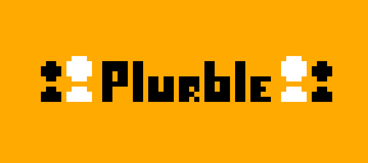
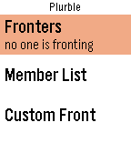
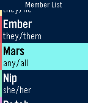

# Plurble

A Simply Plural client for Pebble! Plurble is an app designed to help people who are plural/systems manage and keep track of members on the go!

This was an app originally made for the Rebble Hackathon #002!

## Screenshots

## Feature list
### Current Features
- [x] Real-time syncing with the cloud using the Simply Plural API
- [x] Member list
- [x] Custom front list
- [x] Display/management of currently fronting members/custom fronts
  - [x] Add to front
  - [x] Set as front
  - [x] Remove from front
- [x] App customization
  - [x] Customizable colors
  - [x] Per-member accent colors

### Future features
- [ ] Groups in member list
- [ ] Poll viewing/voting
- [ ] Basic front history viewing
- [ ] Enhanced member info
  - [ ] Card info view with descriptions
- [ ] Friend view
  - [ ] View friend fronting statuses
- [ ] Chat features using dictation (far stretch goal)
